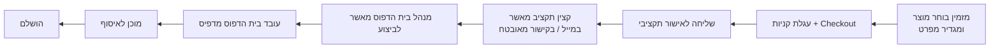
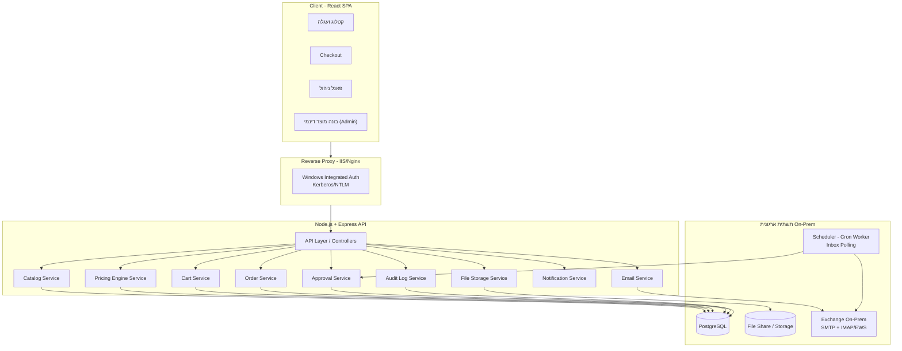
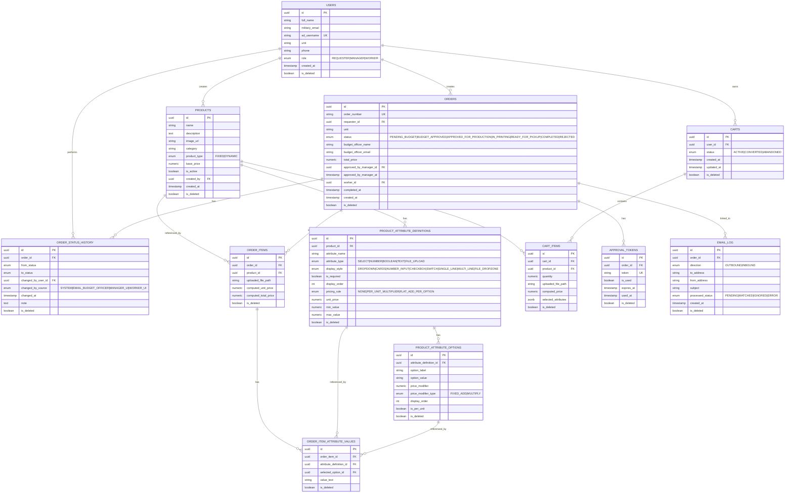
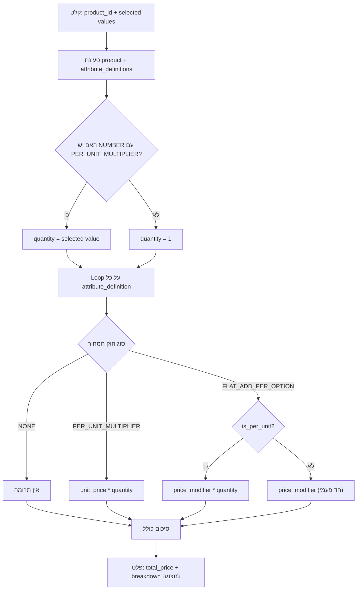
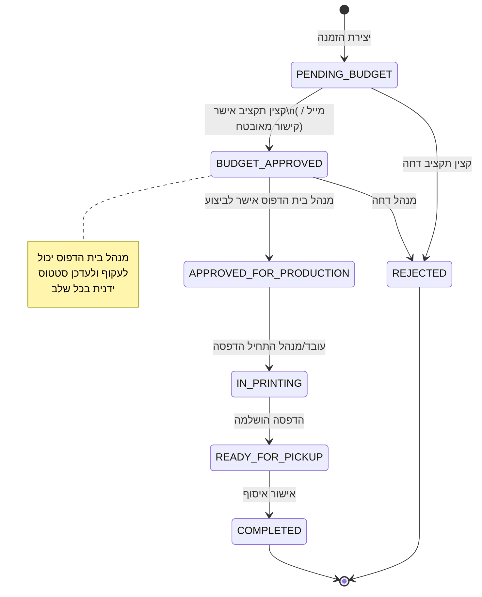
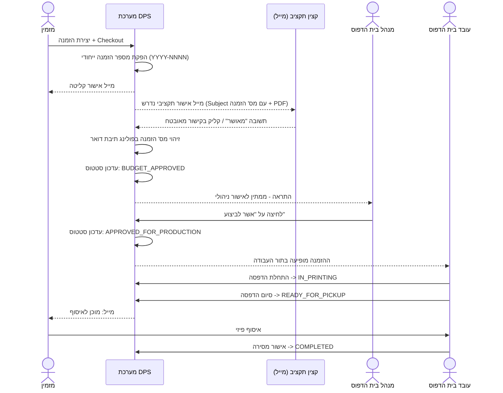

<div dir="rtl" style="text-align: right;">

# מסמך תכן תוכנה (SDD)

## מערכת "הוצאה לאור דיגיטלית" (Digital Publishing System – DPS)

**גרסה:** 1.0
**סטטוס:** מוכן לפיתוח
**שפת פיתוח:** **Stack:** React + Node.js + Express + PostgreSQL + TypeScript

---

## תוכן עניינים

1. [מבוא ורקע](#1-מבוא-ורקע)
2. [מטרות המערכת](#2-מטרות-המערכת)
3. [משתמשים, תפקידים והרשאות](#3-משתמשים-תפקידים-והרשאות)
4. [ארכיטקטורת מערכת – תמונה כללית](#4-ארכיטקטורת-מערכת--תמונה-כללית)
5. [Technology Stack](#5-technology-stack)
6. [מודל נתונים (ERD)](#6-מודל-נתונים-erd)
7. [מנוע המוצר הדינמי (EAV Engine)](#7-מנוע-המוצר-הדינמי-eav-engine)
8. [מנוע תמחור (Pricing Engine)](#8-מנוע-תמחור-pricing-engine)
9. [מכונת מצבים – זרימת הזמנה ואישורים](#9-מכונת-מצבים--זרימת-הזמנה-ואישורים)
10. [אינטגרציית מייל ארגוני (Outlook On-Prem)](#10-אינטגרציית-מייל-ארגוני-outlook-on-prem)
11. [שכבות קוד ו-Services (Backend)](#11-שכבות-קוד-ו-services-backend)
12. [ארכיטקטורת Frontend](#12-ארכיטקטורת-frontend)
13. [API Endpoints](#13-api-endpoints)
14. [אימות והרשאות (Auth)](#14-אימות-והרשאות-auth)
15. [דרישות לא פונקציונליות](#15-דרישות-לא-פונקציונליות)
16. [מקרי קצה – מימוש טכני](#16-מקרי-קצה--מימוש-טכני)
17. [שלבי פיתוח וחלוקת משימות](#17-שלבי-פיתוח-וחלוקת-משימות)
18. [נספחים](#18-נספחים)

---

## 1. מבוא ורקע

מערכת ה-DPS מחליפה תהליך ידני של הזמנת חומרי דפוס מול בית הדפוס הארגוני (הוצל"א), הכולל היום שליחת מיילים חופשיים, המתנה להצעות מחיר, ואישורים טלפוניים. המערכת מספקת קטלוג דיגיטלי, מנוע תמחור אוטומטי, זרימת אישורים דיגיטלית מרובת-שלבים, ופאנל ניהול לעובדי ומנהל בית הדפוס.

### תרשים תהליך עסקי (High Level)



---

## 2. מטרות המערכת

- ביטול תהליך ידני מבוסס מייל חופשי + הצעת מחיר ידנית.
- תמחור אוטומטי ומיידי, כולל עבור מוצרים "מורכבים" (מוגדרים דינמית).
- שרשרת אישורים דיגיטלית עם מעקב סטטוס מלא ומניעת כפילויות.
- פאנל ניהול לעובדי בית הדפוס לתעדוף עבודה.
- שקיפות מלאה למזמין לגבי מצב ההזמנה, ללא צורך בטלפונים.

---

## 3. משתמשים, תפקידים והרשאות

| תפקיד                       | סוג משתמש במערכת                            | תיאור                                                                                                                           |
| --------------------------- | ------------------------------------------- | ------------------------------------------------------------------------------------------------------------------------------- |
| **מזמין** (חייל/קצין)       | משתמש רשום (Windows Integrated Auth)        | יוצר הזמנות, עוקב אחר ההזמנות שלו בלבד                                                                                          |
| **קצין תקציב**              | **לא משתמש רשום** – אינטראקציה חיצונית בלבד | מקבל מייל, מאשר ע"י מענה "מאושר" או קליק על קישור מאובטח חד-פעמי                                                                |
| **מנהל בית הדפוס** (הוצל"א) | משתמש רשום, Role: `MANAGER`                 | הרשאות מלאות: ניהול קטלוג (כולל בניית מוצרים דינמיים), אישור סופי-תקציבי, אישור לביצוע, כל פעולות העובד, שינוי ידני של כל סטטוס |
| **עובד בית הדפוס**          | משתמש רשום, Role: `WORKER`                  | רואה תור עבודה (הזמנות שאושרו לביצוע בלבד), מדפיס, מעדכן סטטוס הדפסה/מוכן לאיסוף                                                |

### מטריצת הרשאות

| פעולה                                                    | מזמין | מנהל |          עובד          |
| -------------------------------------------------------- | :---: | :--: | :--------------------: |
| צפייה בקטלוג                                             |   ✔   |  ✔   |           ✔            |
| יצירת הזמנה חדשה                                         |   ✔   |  –   |           –            |
| צפייה בהיסטוריית הזמנות אישית                            |   ✔   |  –   |           –            |
| צפייה בכל ההזמנות במערכת                                 |   –   |  ✔   | ✔ (רק תור עבודה מאושר) |
| ניהול קטלוג (מוצרי מדף + מוצרים דינמיים)                 |   –   |  ✔   |           –            |
| אישור ידני "אושר ע"י קצין תקציב" (double-check/Fallback) |   –   |  ✔   |           –            |
| אישור "מאושר לביצוע"                                     |   –   |  ✔   |           –            |
| עדכון סטטוס "בהדפסה"                                     |   –   |  ✔   |           ✔            |
| עדכון סטטוס "מוכן לאיסוף"                                |   –   |  ✔   |           ✔            |
| עדכון סטטוס "הושלם"                                      |   –   |  ✔   |           ✔            |
| שינוי ידני/עוקף (Override) לכל סטטוס                     |   –   |  ✔   |           –            |

> **הערת מימוש:** יש להטמיע זאת כהיררכיה: `WORKER` היא תת-קבוצה של הרשאות `MANAGER`. ב-middleware ההרשאות, בדיקה תהיה `role in [MANAGER]` או `role in [MANAGER, WORKER]` בהתאם לפעולה – ולא שתי רשימות נפרדות ומנותקות.

---

## 4. ארכיטקטורת מערכת – תמונה כללית



---

## 5. Technology Stack

| שכבה             | טכנולוגיה                                                           | הערות                                                       |
| ---------------- | ------------------------------------------------------------------- | ----------------------------------------------------------- |
| Frontend         | React 18 + TypeScript                                               | RTL מלא                                                     |
| UI Kit           | MUI (Material UI) + `stylis-plugin-rtl`                             | תמיכת RTL מובנית, כרטיסיות מעוגלות/צלליות עדינות לפי האפיון |
| State Management | React Query (server state) + Zustand (UI state)                     | הפרדה בין קאש שרת למצב ממשק                                 |
| Routing          | React Router v6                                                     |                                                             |
| Backend          | Node.js 20 LTS + Express                                            |                                                             |
| שפה              | TypeScript (Backend + Frontend)                                     | טיפוסים משותפים ע"י חבילת `shared-types`                    |
| DB               | PostgreSQL 15+                                                      |                                                             |
| ORM              | Prisma                                                              | Schema-first, Migrations מובנות                             |
| Auth             | Windows Integrated Authentication (Kerberos/NTLM) מול Reverse Proxy | ללא Login/Logout, לפי האפיון                                |
| Email (Outbound) | SMTP מול Exchange On-Prem (Nodemailer)                              |                                                             |
| Email (Inbound)  | IMAP Polling מול Exchange On-Prem (node-imap / imapflow)            | Worker מתוזמן (node-cron), פולינג כל 1-2 דקות               |
| File Upload      | Multer + Validation Middleware                                      | הגבלת 20MB, PDF/JPEG בלבד                                   |
| File Storage     | תיקיית שיתוף רשת ארגונית (UNC/NFS Mount)                            | נתיב נשמר ב-DB                                              |
| Scheduler        | node-cron                                                           | Polling מייל, ניקוי עגלות נטושות                            |
| Logging          | Winston / Pino + טבלת Audit ב-DB                                    |                                                             |
| Deployment       | On-Prem, ללא תלות באינטרנט חיצוני                                   |                                                             |

---

## 6. מודל נתונים (ERD)



> **הערה:** מוצר "מדף קבוע" (FIXED) הוא בפועל מוצר ללא הגדרות Attributes (או עם Attribute יחיד מסוג כמות) – כך שהמודל אחיד לחלוטין בקוד, וללא צורך בשני מסלולי לוגיקה נפרדים.

---

## 7. מנוע המוצר הדינמי (EAV Engine)

מנהל בית הדפוס בונה מוצר חדש דרך מסך "בונה מוצר" (Admin), ומגדיר עבורו רשימת **מאפיינים (Attributes)** מתוך סוגים סגורים מראש:

| Attribute Type | תיאור                                                         | דוגמה                                        |
| -------------- | ------------------------------------------------------------- | -------------------------------------------- |
| `SELECT`       | רשימה נפתחת עם אופציות קבועות, לכל אופציה תוספת/מחיר משלה     | סוג נייר: כרומו (+0.20 ₪/עמוד) / רגיל (+0 ₪) |
| `NUMBER`       | שדה מספרי עם טווח (min/max), יכול לשמש כ"כמות" עם מחיר ליחידה | כמות עותקים: 100 (מחיר ליחידה 1.5 ₪)         |
| `BOOLEAN`      | תיבת סימון עם תוספת מחיר קבועה אם מסומן                       | כריכת ספירלה: +5 ₪                           |
| `TEXT`         | טקסט חופשי ללא השפעה על מחיר (הערות/פרטים)                    | הערות מיוחדות                                |
| `FILE_UPLOAD`  | העלאת קובץ (PDF/JPEG עד 20MB)                                 | קובץ העיצוב                                  |

### דוגמה מספרית לחישוב מחיר

מוצר: "הדפסת חוברת הדרכה", `base_price = 0`

| Attribute            | ערך שנבחר | חוק תמחור                                    | תרומה למחיר                |
| -------------------- | --------- | -------------------------------------------- | -------------------------- |
| כמות עותקים (NUMBER) | 100       | `PER_UNIT_MULTIPLIER`, unit_price=1.2        | 100 × 1.2 = 120 ₪          |
| סוג נייר (SELECT)    | כרומו     | `FIXED_ADD` על כל היחידה                     | +0.2 ₪ ליחידה × 100 = 20 ₪ |
| כריכה (SELECT)       | ספירלה    | `FLAT_ADD_PER_OPTION` (חד-פעמי, לא לפי כמות) | +8 ₪                       |

**סה"כ:** 120 + 20 + 8 = **148 ₪**

> חוק חשוב שיש להבהיר בקוד: אופציית `SELECT` יכולה להיות מוגדרת כתוספת **ליחידה** (מוכפלת בכמות) או **חד-פעמית** (לא מוכפלת) – שדה בוליאני נוסף `is_per_unit` ב-`PRODUCT_ATTRIBUTE_OPTIONS` קובע זאת.

---

## 8. מנוע תמחור (Pricing Engine)

Service ייעודי, ללא State, מקבל `product_id` + מפת ערכים שנבחרו ומחזיר פירוט מחיר:



**חתימת פונקציה מוצעת (TypeScript):**

```ts
interface PriceBreakdownLine {
  attributeName: string;
  selectedValue: string;
  contribution: number;
}

interface PriceResult {
  totalPrice: number;
  breakdown: PriceBreakdownLine[];
}

function calculatePrice(
  product: ProductWithAttributes,
  selectedValues: Record<string /*attributeDefinitionId*/, string | number | boolean>
): PriceResult;
```

הפונקציה משמשת גם בצד השרת (מקור אמת יחיד למחיר, לפני שמירת הזמנה) וגם בצד הלקוח (תצוגה מקדימה בזמן אמת) – **אך המחיר הסופי הנשמר תמיד מחושב מחדש בשרת**, כדי למנוע מניפולציה של מחיר מצד הלקוח.

---

## 9. מכונת מצבים – זרימת הזמנה ואישורים



### רצף הפעולות המלא (Sequence Diagram)



---

## 10. אינטגרציית מייל ארגוני (Outlook On-Prem)

**החלטה:** שרת Exchange On-Prem ארגוני. שימוש בפרוטוקולים סטנדרטיים בלבד (ללא תלות ב-Microsoft Graph/Cloud):

- **שליחה (Outbound):** SMTP דרך Nodemailer, מול שרת ה-Exchange הפנימי.
- **קליטה (Inbound):** IMAP Polling (ספריית `imapflow` או `node-imap`) מול תיבת דואר ייעודית של בית הדפוס, בתדירות של כל 1–2 דקות (Cron Job).

### לוגיקת זיהוי תשובת קצין תקציב

1. Worker מתוזמן סורק תיבת נכנסות (`INBOX`) לפי `unseen` בלבד.
2. חילוץ מספר הזמנה מתוך כותרת המייל בפורמט קבוע: `אישור תקציבי נדרש להזמנת הוצאה לאור מספר YYYY-NNNN`.
3. בדיקה שגוף המייל מכיל את המילה "מאושר" (Case/Whitespace insensitive, טרימינג של ציטוט מייל קודם).
4. אם נמצאה התאמה: קריאה ל-`ApprovalService.approveByEmail(orderNumber, fromAddress)`.
5. **הגנת אידמפוטנטיות:** לפני עדכון סטטוס, נבדק שה-status הנוכחי הוא `PENDING_BUDGET` בלבד (עדכון בתוך Transaction עם row lock) – מייל כפול/מאוחר לא ישנה סטטוס פעמיים.
6. כל מייל נכנס נרשם בטבלת `EMAIL_LOG` (כולל אם לא זוהתה התאמה) – לצורך Debug ואודיט.

### קישור מאובטח חלופי (Fallback)

לצד המענה למייל, כל מייל לקצין התקציב מכיל גם קישור חד-פעמי (`APPROVAL_TOKENS.token`), המוביל לעמוד ציבורי מינימלי (ללא התחברות) המציג סיכום הזמנה וכפתור "אשר". לחיצה מסמנת את ה-Token כ-`is_used=true` ומפעילה את אותה לוגיקת `ApprovalService`.

### תבנית מייל לקצין תקציב

```
נושא: אישור תקציבי נדרש להזמנת הוצאה לאור מספר 2026-1004 – [שם המזמין]

תוכן:
פירוט הפריטים שהוזמנו:
- [שם מוצר] × [כמות] – [מחיר]
...
סה"כ עלות: [total_price] ₪

לאישור ההזמנה, השב למייל זה במילה "מאושר",
או לחץ כאן: [קישור מאובטח]
```

---

## 11. שכבות קוד ו-Services (Backend)

מבנה שכבתי קלאסי: `Routes -> Controllers -> Services -> Repositories (Prisma) -> DB`

| Service                  | אחריות                                                                      |
| ------------------------ | --------------------------------------------------------------------------- |
| **CatalogService**       | CRUD למוצרים, הגדרות Attributes ואופציות; ולידציה על מבנה מוצר דינמי        |
| **PricingEngineService** | חישוב מחיר טהור (Stateless) לפי סעיף 8                                      |
| **CartService**          | ניהול עגלה פעילה למשתמש, שמירה אוטומטית, המרה ל-Order                       |
| **OrderService**         | יצירת הזמנה, הפקת מספר סידורי ייחודי, שליפה לפי הרשאות                      |
| **ApprovalService**      | מכונת המצבים כולה; אכיפת מעברים חוקיים; אידמפוטנטיות                        |
| **EmailService**         | שליחה (SMTP) + Polling נכנס (IMAP) + Templates + פירוק/זיהוי הזמנה          |
| **FileStorageService**   | ולידציית גודל/סוג קובץ, שמירה בנתיב רשת, הפקת קישור הורדה                   |
| **NotificationService**  | ריכוז כל שליחת ההתראות (מייל + In-App) כך שממשק אחיד לכל שאר ה-Services     |
| **AuditLogService**      | רישום כל שינוי סטטוס/אישור ל-`ORDER_STATUS_HISTORY`, כולל מקור השינוי       |
| **AuthService**          | מיפוי זהות AD (מה-Reverse Proxy) למשתמש פנימי, Auto-provision בכניסה ראשונה |
| **CartCleanupJob**       | Cron: זיהוי עגלות פעילות ישנות (>X ימים) לסימון `ABANDONED`                 |

### עקרון מפתח: הפרדת אחריות באישורים

`ApprovalService` הוא ה-Single Source of Truth למעברי סטטוס. גם ה-Controller של המנהל בממשק, גם ה-Poller של המייל, וגם עמוד הקישור המאובטח – **כולם קוראים לאותן פונקציות פנימיות** (`approveBudget`, `approveForProduction`, וכו') ולא מממשים לוגיקת מעבר סטטוס באופן עצמאי. כך מובטחת אכיפת חוקיות מעברים ואידמפוטנטיות במקום אחד בלבד.

---

## 12. ארכיטקטורת Frontend

```
src/
  app/                     # App shell, routing, providers
  pages/
    catalog/               # קטלוג מוצרים
    product-detail/         # טופס הגדרת מוצר (רנדור דינמי לפי Attributes)
    cart/
    checkout/
    my-orders/              # היסטוריית הזמנות אישית (מזמין)
    admin/
      orders-table/         # טבלת ניהול הזמנות (מנהל+עובד)
      order-detail/
      product-builder/       # בונה מוצר דינמי (מנהל בלבד)
  components/
    DynamicAttributeInput/   # רכיב גנרי: קלט לפי attribute_type
    PriceBreakdown/
    StatusBadge/
    FileUploadDropzone/
    CartRecoveryBanner/       # מקרה קצה - עגלה נטושה
  services/                  # API clients (React Query hooks)
  store/                      # Zustand (UI state בלבד)
  theme/                       # RTL theme, עיצוב MUI
```

**רכיב מפתח:** `DynamicAttributeInput` — מקבל `attribute_definition` ומרנדר את סוג הקלט המתאים (Select/Number/Checkbox/Text/FileUpload), כולל ולידציה מקומית (min/max, required, סוג קובץ) לפני קריאה ל-Pricing Engine בזמן אמת (Debounced API call).

---

## 13. API Endpoints

### Catalog Service

| Method     | Path                           | הרשאה   |
| ---------- | ------------------------------ | ------- |
| GET        | `/api/products`                | כולם    |
| GET        | `/api/products/:id`            | כולם    |
| POST       | `/api/products`                | MANAGER |
| PUT        | `/api/products/:id`            | MANAGER |
| DELETE     | `/api/products/:id`            | MANAGER |
| POST       | `/api/products/:id/attributes` | MANAGER |
| PUT/DELETE | `/api/attributes/:id`          | MANAGER |

### Cart Service

| Method | Path                      | הרשאה                        |
| ------ | ------------------------- | ---------------------------- |
| GET    | `/api/cart`               | REQUESTER                    |
| POST   | `/api/cart/items`         | REQUESTER                    |
| DELETE | `/api/cart/items/:id`     | REQUESTER                    |
| POST   | `/api/cart/price-preview` | REQUESTER (לפני הוספה לעגלה) |
| POST   | `/api/cart/checkout`      | REQUESTER                    |

### Order Service

| Method | Path                               | הרשאה                                      |
| ------ | ---------------------------------- | ------------------------------------------ |
| GET    | `/api/orders`                      | MANAGER/WORKER (הכל), REQUESTER (שלו בלבד) |
| GET    | `/api/orders/:id`                  | לפי בעלות/תפקיד                            |
| POST   | `/api/orders/:id/manager-approve`  | MANAGER                                    |
| POST   | `/api/orders/:id/start-printing`   | MANAGER/WORKER                             |
| POST   | `/api/orders/:id/ready-for-pickup` | MANAGER/WORKER                             |
| POST   | `/api/orders/:id/complete`         | MANAGER/WORKER                             |
| PATCH  | `/api/orders/:id/status`           | MANAGER (Override בלבד)                    |

### Approval (ציבורי, מבוסס Token)

| Method | Path                            | הרשאה           |
| ------ | ------------------------------- | --------------- |
| GET    | `/api/approvals/:token`         | ציבורי          |
| POST   | `/api/approvals/:token/approve` | ציבורי, חד-פעמי |

### Files

| Method | Path                | הרשאה     |
| ------ | ------------------- | --------- |
| POST   | `/api/files/upload` | REQUESTER |

---

## 14. אימות והרשאות (Auth)

- Reverse Proxy (IIS או Nginx עם מודול Kerberos) מבצע **Windows Integrated Authentication** מול ה-Domain Controller הארגוני, ומעביר את זהות המשתמש (`REMOTE_USER` / כותרת HTTP) ל-Backend.
- `AuthService` ב-Backend ממפה `ad_username` לרשומת `USERS` פנימית. בכניסה ראשונה — Auto-provisioning (יצירת רשומה עם role ברירת מחדל `REQUESTER`; שיוך ל-`MANAGER`/`WORKER` נעשה ידנית ע"י מנהל מערכת/DBA).
- אין מסך Login/Logout — תואם לדרישה המקורית ("המערכת נשארת מחוברת תמידית").
- כל בקשה ל-API עוברת Middleware הרשאות (RBAC) הבודק את ה-role מול הפעולה המבוקשת (טבלת ההרשאות בסעיף 3).
- קצין תקציב **אינו נכנס למערכת כלל** — כל האינטראקציה שלו חיצונית (מייל/קישור טוקן ציבורי מאובטח).

---

## 15. דרישות לא פונקציונליות

- **פריסה:** On-Prem בלבד, ללא תלות בשירותי ענן חיצוניים (תואם לדרישת שרת Exchange מקומי).
- **דפדפנים:** Chrome/Edge עדכניים (תואמי סביבת מחשוב ארגונית).
- **RTL מלא** בכל מסכי המערכת, כולל טפסים ותפריטים.
- **לוגים ואודיט:** כל שינוי סטטוס/פעולת אישור נרשמת (`ORDER_STATUS_HISTORY`) עם Actor, Timestamp ומקור.
- **גיבויים:** גיבוי יומי ל-DB ולתיקיית הקבצים (באחריות צוות התשתיות הארגוני).
- **ביצועים:** תמיכה בעומס של מאות הזמנות ביום ועשרות משתמשים מקבילים (היקף פנים-ארגוני, לא Internet-scale).
- **נגישות:** תוויות ARIA לרכיבי הטופס הדינמי, ניגודיות צבעים תקנית.

---

## 16. מקרי קצה – מימוש טכני

### קובץ גדול מדי / פורמט שגוי

- ולידציה כפולה: Client-side (מיידית, לפני שליחה לשרת) + Server-side (חובה, לא ניתן לעקוף).
- מגבלה: 20MB, סוגי קובץ מותרים: `application/pdf`, `image/jpeg`.
- הודעת שגיאה ידידותית מיידית; כפתור "הוסף לעגלה" נשאר חסום (`disabled`) עד להעלאת קובץ תקין.

### אישור תקציבי כפול

- מטופל במלואו ע"י `ApprovalService` (סעיף 11) עם Transaction + בדיקת סטטוס נוכחי לפני עדכון.
- בממשק: לאחר אישור, הכפתור נעלם והופך לטקסט קבוע `אושר ע"י [שם] בתאריך [X]` — מבוסס על שדה `ORDER_STATUS_HISTORY` האחרון הרלוונטי, לא ניתן ללחוץ שוב מכל משתמש/מכשיר.

### עגלה נטושה

- עגלה (`CARTS`) משויכת ל-`user_id` (לא ל-LocalStorage/Session דפדפן) — הודות ל-Windows Integrated Auth, המשתמש מזוהה אוטומטית גם בביקור הבא.
- בכל כניסה, המערכת בודקת אם קיימת עגלה `ACTIVE` עם פריטים ומציגה `CartRecoveryBanner`.
- `CartCleanupJob` (Cron יומי) מסמן עגלות פעילות שלא עודכנו מעל N ימים כ-`ABANDONED` (לצורך ניקוי/דוחות בלבד, לא מוחק נתונים).

---

## 17. שלבי פיתוח וחלוקת משימות

| שלב                             | תוכן                                                                                                      | הערכת זמן  |
| ------------------------------- | --------------------------------------------------------------------------------------------------------- | ---------- |
| **Phase 0 – תשתית**             | סביבות Dev/Staging/Prod, Postgres, CI/CD, Auth (IWA), Logging, מבנה קוד                                   | 1–2 שבועות |
| **Phase 1 – קטלוג ומנוע דינמי** | CatalogService, Attribute/Options models, PricingEngineService + טסטים, בונה מוצר (Admin UI), עמודי קטלוג | 2–3 שבועות |
| **Phase 2 – עגלה והזמנה**       | CartService (autosave), FileStorageService, OrderService (מספור), UI: טופס מוצר דינמי, עגלה, Checkout     | 2 שבועות   |
| **Phase 3 – אישורים ומייל**     | EmailService (SMTP+IMAP), ApprovalService, Approval Token flow, ManagerApproval UI                        | 2–3 שבועות |
| **Phase 4 – פאנל ניהול**        | טבלת הזמנות, מסך פרטי הזמנה, תור עבודה לעובד, ניהול קטלוג מלא                                             | 2 שבועות   |
| **Phase 5 – QA ו-Hardening**    | מקרי קצה, בדיקות עומס, אבטחה, UAT עם משתמשי קצה                                                           | 1–2 שבועות |

**סה"כ הערכה:** כ-10–13 שבועות עבודה (תלוי בגודל צוות).

### חלוקת משימות מוצעת לצוות

| תפקיד          | אחריות                                                            |
| -------------- | ----------------------------------------------------------------- |
| Backend Dev A  | CatalogService + PricingEngineService (Phase 1)                   |
| Backend Dev B  | OrderService + ApprovalService + EmailService (Phase 2–3)         |
| Frontend Dev A | קטלוג, טופס מוצר דינמי, עגלה, Checkout                            |
| Frontend Dev B | פאנל ניהול (טבלת הזמנות, בונה מוצר, מסכי Admin)                   |
| DevOps/Infra   | סביבות, Auth (IWA/Reverse Proxy), חיבור ל-Exchange On-Prem, פריסה |

---

## 18. נספחים

### פורמט מספר הזמנה

`{YYYY}-{NNNN}` — שנה נוכחית + מספר סידורי בן 4 ספרות (Sequence לפי שנה ב-DB). דוגמה: `2026-1004`.

### רשימת סטטוסים סופית

`PENDING_BUDGET` → `BUDGET_APPROVED` → `APPROVED_FOR_PRODUCTION` → `IN_PRINTING` → `READY_FOR_PICKUP` → `COMPLETED`
(מסלול חלופי: `REJECTED` מ-`PENDING_BUDGET` או `BUDGET_APPROVED`)

### נקודות פתוחות להבהרה מול הצוות הארגוני (מומלץ לסגור לפני Phase 3)

- פרטי גישה מדויקים לשרת ה-Exchange On-Prem (Host, פורטים, האם IMAP פתוח או שיידרש EWS).
- מיקום פיזי/נתיב לתיקיית שיתוף הקבצים הארגונית ומדיניות סריקת אנטי-וירוס לקבצים שהועלו.
- מדיניות שמירת נתונים/ארכוב הזמנות ישנות (כמה זמן לשמור קבצי PDF).
